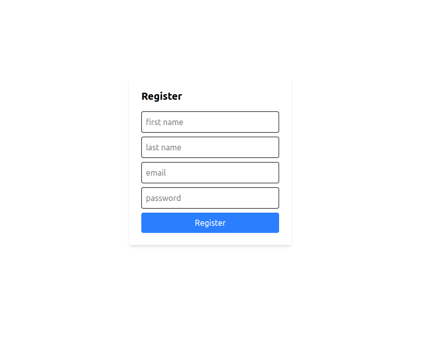
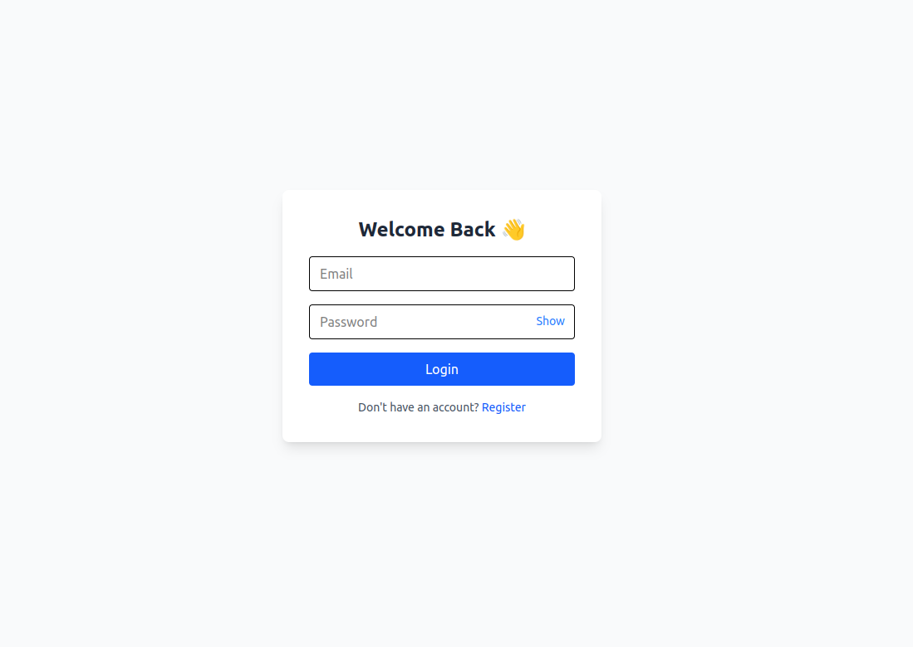
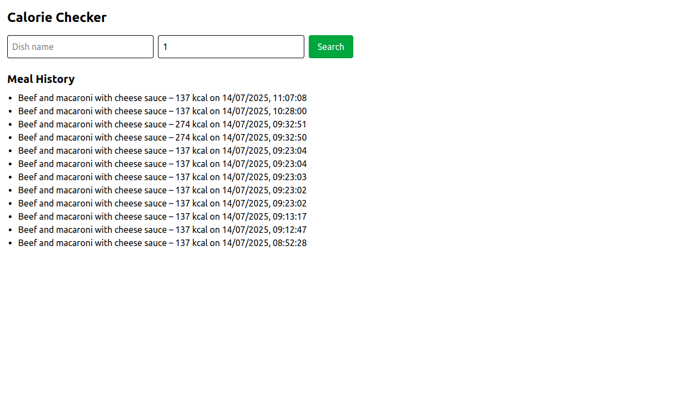

# 📦 Meal Calorie Count Generator - Full Stack Project

This project is a full-stack application that allows users to register, log in, and search for meals to get their calorie and macronutrient breakdown using the USDA FoodData Central API. The application also logs each search into a user-specific meal history.

---

## ⚙️ Backend (FastAPI)

### ✅ Features
- User authentication (JWT-based)
- Search meals via USDA API with fuzzy matching
- Return calorie + macronutrients (protein, fat, carbs)
- Save searched meals to user history
- Secure rate-limited endpoints

### 🧱 Tech Stack
- Python + FastAPI
- PostgreSQL (or SQLite for testing)
- SQLAlchemy ORM
- JWT + OAuth2 (login/register)
- RapidFuzz (fuzzy matching)

### 📁 Folder Structure

```
app/
├── api/routes      # Route files
├── controllers     # Business logic controllers
├── core # Security, config, rate limiter
├── database # Session + base
├── models # SQLAlchemy models
├── schemas # Pydantic schemas
├── services # USDA + calorie service
├── utils # USDA wrapper + fuzzy matcher
```


### 🚀 Run the Backend
```bash
uvicorn app.main:app --reload
```

### ✅ API Endpoints

- ``POST /api/auth/register`` – Register a user
- ``POST /api/auth/login`` – Login and get token
- ``POST /api/get-calories``  – Search for a dish
- ``GET /api/meals`` – Fetch user's meal history

### ✅ Testing (Pytest)

Install:

```bash pip install pytest httpx```

#### File: ``tests/test_calorie_api.py``

```commandline
import pytest
from fastapi.testclient import TestClient
from app.main import app

client = TestClient(app)

def test_calorie_endpoint_with_invalid_servings():
    response = client.post("/api/get-calories", json={"dish_name": "pasta", "servings": 0})
    assert response.status_code == 400
    assert "Invalid servings" in response.json()["detail"]

def test_calorie_endpoint_with_invalid_dish():
    response = client.post("/api/get-calories", json={"dish_name": "zzzznotreal", "servings": 2})
    assert response.status_code == 404

# Authenticated tests should use JWT token if testing with user auth

```

### ✅ How to Run the Tests

```commandline
pytest tests/test_auth_and_meals.py
```

## 🧑‍💻 Frontend (React + Vite + Tailwind)

### ✅ Features

- Login / Register UI with JWT storage
- Meal search form with calorie and macro display
- Meal history list for the user

### 🧱 Tech Stack

- React (Vite) + Tailwind CSS
- Axios (API calls)
- React Router DOM

### 📁 Folder Structure

```
src/
├── pages/         # Login, Register, Dashboard
├── store/         # Redux store + slices
├── components/    # Forms, Cards (optional)
├── App.jsx
├── main.jsx
```

### 🚀 Run the Frontend

```commandline
npm install
npm run dev
```

### 🌐 Environment Variable

Create ``.env`` file:

```commandline
VITE_API_BASE_URL=http://localhost:8000
```

### 📷 Screenshot

## Registration page



## Login



## Dashboard



### ✅ Getting Started

- Clone this repo

- Set up backend .env with USDA key + secret

- Create .env for frontend as shown above

- Start backend + frontend servers

- Register → Login → Search Meals

### 📬 API Notes

USDA API docs: https://fdc.nal.usda.gov/api-guide.html

You must sign up and get a free USDA API key and place it in your ``.env``:

```
USDA_API_KEY=your_api_key_here
```

### 🧠 Contributions

PRs welcome. Try to follow structure and add test coverage.

### 📜 License
MIT License